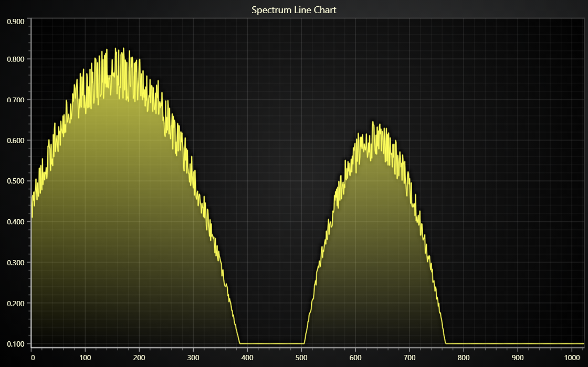

# Refreshing Spectrum Line JavaScript Chart

This demo application belongs to the set of examples for LightningChart JS, data visualization library for JavaScript.

LightningChart JS is entirely GPU accelerated and performance optimized charting library for presenting massive amounts of data. It offers an easy way of creating sophisticated and interactive charts and adding them to your website or web application.

The demo can be used as an example or a seed project. Local execution requires the following steps:

-   Make sure that relevant version of [Node.js](https://nodejs.org/en/download/) is installed
-   Open the project folder in a terminal:

          npm install              # fetches dependencies
          npm start                # builds an application and starts the development server

-   The application is available at _http://localhost:8080_ in your browser, webpack-dev-server provides hot reload functionality.

## Description

This example showcases a common line chart application, where the displayed line data set is changed very rapidly.

This example uses spectrogram data, so the line chart displays the latest spectrum only.

When compared to a [spectrogram](https://lightningchart.com/lightningchart-js-interactive-examples/examples/lcjs-example-0805-spectrogramProjection.html), this is the same but without a view of the data history.

**About performance...**

While there are numerous different Line Chart tools available in web, the wide majority (> 95%) are not designed nor suitable for applications such as this, where the data set is changed in super fast intervals.

We at LightningChart have studied various different web data visualization tools to support our mission of being the web chart with the best performance in the world.

These studies are all publicly available and can be found on our website in our definite favorite [Performance section](https://lightningchart.com/high-performance-javascript-charts/).

## API Links

* [XY chart]
* [Line Series]
* [Axis]

## Support

If you notice an error in the example code, please open an issue on [GitHub][0] repository of the entire example.

Official [API documentation][1] can be found on [LightningChart][2] website.

If the docs and other materials do not solve your problem as well as implementation help is needed, ask on [StackOverflow][3] (tagged lightningchart).

If you think you found a bug in the LightningChart JavaScript library, please contact sales@lightningchart.com.

Direct developer email support can be purchased through a [Support Plan][4] or by contacting sales@lightningchart.com.

[0]: https://github.com/Arction/
[1]: https://lightningchart.com/lightningchart-js-api-documentation/
[2]: https://lightningchart.com
[3]: https://stackoverflow.com/questions/tagged/lightningchart
[4]: https://lightningchart.com/support-services/

© LightningChart Ltd 2009-2025. All rights reserved.

[XY chart]: https://lightningchart.com/js-charts/api-documentation/v8.1.0/classes/ChartXY.html
[Line Series]: https://lightningchart.com/js-charts/api-documentation/v8.1.0/classes/PointLineAreaSeries.html
[Axis]: https://lightningchart.com/js-charts/api-documentation/v8.1.0/classes/Axis.html

